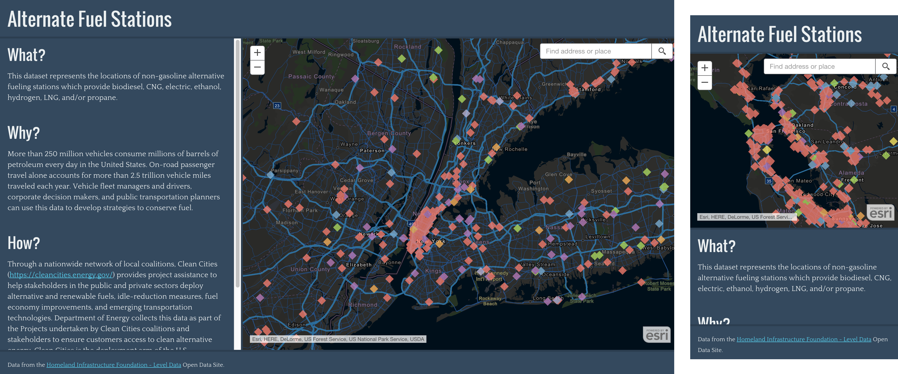

<!-- .slide: data-background="./img/2020/devsummit/bg-1.png" -->

<h1 style="text-align: left; font-size: 80px; margin-top: -90px;"><b>JavaScript</b> and <b>CSS</b> <i>for Geographers</i></h1>
    <p style="text-align: left; font-size: 1.5em;">Patrick Arlt, Allison Davis & Nate Bedortha</p>
    <p style="text-align: left; font-size: 1.5em;">Slides: <a href="http://bit.ly/2PLJft4" style="font-family: monospace;">http://bit.ly/2PLJft4</a>

<aside class="notes">
(Allison, Nate, Pat)

@TODO verify names and slide link
</aside>

---

<!-- .slide: data-background="./img/2020/devsummit/bg-4.png" -->

## This talk is all fundamentals.

<aside class="notes">
(Allison)
* This is a very quick introduction to the world of web development - html, css, and JavaScript
</aside>

---

<!-- .slide: data-background="./img/2020/devsummit/bg-3.png" -->

## First, Some Notes

Lots of supplemental info in these slides.

Designed to help you keep learning beyond this talk.

Pretty much everything is a link.

Slides <a href="http://bit.ly/2PLJft4" style="font-family: monospace;">http://bit.ly/2PLJft4</a>

<aside class="notes">
(Allison)
* this is a lot to cover in a very short amount of time
* so don't worry if things don't make sense right away
</aside>

---

<!-- .slide: data-background="./img/2020/devsummit/bg-3.png" -->

## Web Development is Hard

* It's ok to feel overwhelmed
* Good news: you're more equipped than you think!

* Scripted with ArcPy?
* Scripted with Python?
* Configured an app?
* Used Arcade?
* Used Model Builder?


<aside class="notes">
(Allison)
* Technical knowledge from GIS translates very well to web development
</aside>

---

<!-- .slide: data-background="./img/2020/devsummit/bg-3.png" -->

## A quick note on web servers

* HTML, CSS, and JS all go in your web server

* [How to set up a local web server](https://gist.github.com/jgravois/5e73b56fa7756fd00b89)

* Install [Node](https://nodejs.org) > Terminal/Command Line/Windows Bash/Powershell
```bash
npx http-server .
```

* For fast prototyping use [CodePen](https://codepen.io) or [StackBlitz](https://stackblitz.com/)


<aside class="notes">
(Allison)
Using a web server doesn't necessarily mean you're serving pages on the internet for all to see.
You can use a local web server to load your own static files
Not comfortable on the command line? There are tons of great free resources online. Links to some in the resources slide
In a hurry? Use a web tool like CodePen - there are lots of options
</aside>

---

<!-- .slide: data-background="./img/2020/devsummit/bg-3.png" -->

## HTML

```html
<!DOCTYPE html>
<html>
  <head>
    <meta charset="utf-8">
    <title>Hello!</title>
    <!-- <link> (CSS) goes here -->
  </head>
  <body>
    <!-- Content (more html) goes here -->
    <h1>Welcome</h1>
    <div>Here's some unstyled content.</div>
    <!-- <script> (JavaScript) goes here -->
  </body>
</html>
```
* [Try it in CodePen](https://codepen.io/araedavis/pen/eYNeBXo)
* [MDN's HTML docs and guides](https://developer.mozilla.org/en-US/docs/Web/HTML)

<aside class="notes">
(Allison)


</aside>

---

<!-- .slide: data-background="./img/2020/devsummit/bg-4.png" -->

## CSS

<pre style="font-size: 125%;"><code class="ss">html, body, #map {
  margin: 0;
  width: 100%;
  height: 100%;
}</code></pre>

<aside class="notes">
(Nate)
CSS is a language for specifying how documents are presented to users — how they are styled, laid out, etc.
</aside>

---

<!-- .slide: data-background="./img/2020/devsummit/bg-2.png" -->

### Where does CSS go?

- Inside a `.css` file that is loaded with a `<link>` tag.
  ```html
  <link href="my-css-file.css" rel="stylesheet" />
  ```
- Inside a `<style>` tag.
  ```html
  <style>
    /* Put CSS here*/
  </style>
  ```
- Inside an element’s `style` attribute. ⚠️
  ```html
  <p style="color:blue;">Blue text!</p>
  ```

<aside class="notes">
(Nate)

A link tag is the most common place to put CSS. Many HTML documents can reference the same CSS document.

Inline styles are a bit tricky, and they only affect a single element.

</aside>

---

<!-- .slide: data-background="./img/2020/devsummit/bg-2.png" -->

### What does CSS look like?

<pre style="font-size: 125%;"><code class="ss">html, body, #map {
  margin: 0;
  width: 100%;
  height: 100%;
}</code></pre>

<aside class="notes">
(Nate)
This is a single CSS rule.
Selectors: How we target something in our document.
Properties: Identifiers that indicate stylistic features.
Values: Each property is given a value that indicates your changes to that feature.

</aside>

---

<!-- .slide: data-background="./img/2020/devsummit/bg-2.png" -->

## The "C" is for Cascading<p>

Styles _cascade_ into the final styles for the HTML elements that match their selectors.

- Browser and user styles
- <code>&lt;link rel="stylesheet"&gt;</code>
- <code>&lt;style&gt;</code> tags
- Style attributes <code>&lt;div style="..."&gt;</code>

<aside class="notes">
(Nate)
The way the cascade behaves is the key to understanding CSS.
The order of the rules matter: the last rule in the source wins.
But what happens when we declare the same properties: collision!
</aside>

---

<!-- .slide: data-background="./img/2020/devsummit/bg-2.png" -->

### CSS Specificity

When properties collide specificity determines which property wins.

1. Rules with `!important`
2. Inline styles `<div style="...">`
3. `<style>` and `<link>` tags
4. Selector specificity
   1. `#id-attribute` - &lt;div id="..."&gt;
   2. `.class-attribute` - &lt;div class="..."&gt;
   3. `div` - &lt;div&gt;

<aside class="notes">
(Nate)
Each type of selector is more *specific* than the next.
An ID selector can only match one element.
A class selector can match different element types.
An element selector matches all elements!

</aside>

---

<!-- .slide: data-background="./img/2020/devsummit/bg-2.png" -->

### Let's inspect some CSS

Right click on something you want to change click "Inspect Element"

[Explore a Storymap](https://story.maps.arcgis.com/apps/Cascade/index.html?appid=46daf1304a0c4ad69a8935c7ed2ab692)

<aside class="notes">
(Nate) Preload this tab
</aside>

---

<!-- .slide: data-background="./img/2020/devsummit/bg-6.png" -->

## Let's Build an App!



<aside class="notes">
(Nate)
We've got a great idea for a web app: a map that displays the locations of non-gasoline alternative fueling stations.
How do we build it?
Let's start by thinking of the components of our app as "boxes"; in this case, we have a box for text information, and a box for our map.
</aside>

---

<!-- .slide: data-background="./img/2020/devsummit/bg-2.png" -->

<h2><a href="https://codepen.io/oknoway/pen/KKpyMJK?editors=1100">Block</a> vs <a href="https://codepen.io/oknoway/pen/GRJOqLY?editors=1100">Inline</a></h2>

<ul>
  <li><a href="https://developer.mozilla.org/en-US/docs/Web/HTML/Block-level_elements">Block-level elements</a></li>
  <li><a href="https://developer.mozilla.org/en-US/docs/Web/HTML/Inline_elements">Inline elements</a></li>
  <li><a href="http://learnlayout.com/display.html">Learn CSS Layout: the "display" property</a></li>
  <li><a href="https://developer.mozilla.org/en-US/docs/Learn/CSS/CSS_layout/Normal_Flow">Normal Flow</a></li>
  <li><a href="https://developer.mozilla.org/en-US/docs/Web/CSS/CSS_Flow_Layout/Block_and_Inline_Layout_in_Normal_Flow">Block and Inline Layout in Normal Flow</a></li>
</ul>

<aside class="notes">
(Nate)
By default (normal flow) all elements are either *block* or *inline*, but not both.
Block elements are laid out out one after the other, vertically, beginning at the top of a containing block.
Inline elements are laid out horizontally, one after the other, beginning at the top of a containing block.
</aside>

---

<!-- .slide: data-background="./img/2020/devsummit/bg-2.png" -->

<h2><a href="https://codepen.io/oknoway/pen/BaNmLQX?editors=1100">Units</h2>

<ul>
  <li><a href="https://developer.mozilla.org/en-US/docs/Web/CSS/length">Full unit reference</a></li>
  <li><a href="https://css-tricks.com/the-lengths-of-css/">The Lengths of CSS</a></li>
  <li><a href="http://www.quirksmode.org/css/units-values/">Unit and Values - QuirksMode</a></li>
  <li><a href="https://www.youtube.com/watch?v=_sgF8I-Q1Gs">📺 Layout Land: Introduction to Viewport Units</a></li>
</ul>

<aside class="notes">
(Nate)
There are lots of different units, but usually we're talking about length units. Length units can be either Absolute or Relative.
Absolute length units represent an actual physical measurement: pixels, inches, or centimeters.
For a long time, we used pixels for every length, but as viewport sizes change, and designs needed to become more flexible, we needed:
Relative length units represent a measurement in terms of some other distance:
the size of a specific character or the line-height of a font, or the size of the viewport.
</aside>

---

<!-- .slide: data-background="./img/2020/devsummit/bg-2.png" -->

<h2><a href="https://codepen.io/oknoway/pen/vYOWXjM?editors=1100">Flexbox</a></h2>

<ul>
  <li><a href="http://flexboxfroggy.com/">Flexbox Froggy</a></li>
  <li><a href="http://learnlayout.com/flexbox.html">Learn CSS Layout: flexbox</a></li>
  <li><a href="https://css-tricks.com/snippets/css/a-guide-to-flexbox/">A Complete Guide to Flexbox</a></li>
  <li><a href="https://developer.mozilla.org/en-US/docs/Web/CSS/CSS_Flexible_Box_Layout">MDN: CSS Flexible Box Layout</a></li>
</ul>

<aside class="notes">
(Nate)
Flexbox is a layout model that's optimized for UI design.
Flexible boxes layout their children along one dimension: by default horizontally (rows) or vertically (columns).
Flex children can "flex" their size to grow or shrink without overflowing their parents.
</aside>

---

<!-- .slide: data-background="./img/2020/devsummit/bg-2.png" -->

<h2><a href="https://codepen.io/oknoway/pen/OJVObgW?editors=1100">Positioning</a></h2>

<ul>
  <li><a href="http://learnlayout.com/position.html">Learn CSS Layout: position</a></li>
  <li><a href="https://developer.mozilla.org/en-US/docs/Web/CSS/position">MDN: position</a></li>
</ul>

<aside class="notes">
(Nate)
The Position property allows elements to be positioned in a document, relative to other elements.
We can use it to overlap elements over one another.
Flexbox + Position allows a lot of layout options, but for even more control, we need…
</aside>

---

<!-- .slide: data-background="./img/2020/devsummit/bg-2.png" -->

<h2><a href="https://codepen.io/oknoway/pen/JjdORQw?editors=1100">Grid Layout</a></h2>

<ul>
  <li><a href="http://cssgridgarden.com/">Grid Garden</a></li>
  <li><a href="https://css-tricks.com/snippets/css/complete-guide-grid/">A Complete Guide to Grid</a></li>
  <li><a href="https://gridbyexample.com/">Grid by Example</a></li>
  <li><a href="https://developer.mozilla.org/en-US/docs/Web/CSS/CSS_Grid_Layout">MDN: CSS Grid Layout</a></li>
  <li><a href="https://www.youtube.com/watch?v=tFKrK4eAiUQ/">📺 Incredibly Easy Layouts with CSS Grid</a></li>
</ul>

<p><a href="https://codepen.io/oknoway/pen/rNVYWNK?editors=1100">Bonus Demo: CSS Grid Template Areas</a></p>

<aside class="notes">
(Nate)
Grid Layout is an extremely powerful layout model that can layout entire page areas, or small user interface elements.
The grid is an intersecting set of horizontal and vertical lines that allows you to define fixed or flexible tracks and easily place and position elements.
</aside>

---

<!-- .slide: data-background="./img/2020/devsummit/bg-2.png" -->

<h2><a href="https://codepen.io/oknoway/pen/RwPjoaP?editors=1100">Media Queries and Responsive Design</a></h2>

<ul>
  <li><a href="http://mediaqueri.es/">Responsive design gallery</a></li>
  <li><a href="https://developer.mozilla.org/en-US/docs/Web/CSS/Media_Queries">MDN: Media Queries</a></li>
  <li><a href="https://css-tricks.com/snippets/css/media-queries-for-standard-devices/">Media Queries for Standard Devices</a></li>
  <li><a href="http://learnlayout.com/media-queries.html">Learn CSS Layout: media queries</a></li>
</ul>

<aside class="notes">
(Nate)
Media queries are the foundation of responsive design. They allow your design to adapt to the various device characteristics or settings.
You can change your design when a user turns on "dark mode", or asks for animation to be disabled.
Most frequently, we adapt our design to the size of the user's viewport.
</aside>

---

<!-- .slide: data-background="./img/2020/devsummit/bg-2.png" -->

<h2><a href="https://codepen.io/oknoway/pen/vYOWyyO?editors=1100">Typography and Color</a></h2>

<ul>
  <li><a href="https://www.google.com/fonts">Google Fonts</a></li>
  <li><a href="http://femmebot.github.io/google-type/">Google Web Fonts Typographic Project</a></li>
  <li><a href="http://fontpair.co/">Font Pair</a></li>
  <li><a href="http://type-scale.com/">TypeScale</a></li>
</ul>
<ul>
  <li><a href="https://flatuicolors.com/">Flat UI Colors</a></li>
  <li><a href="https://color.adobe.com/create/color-wheel/">Adobe Color Wheel</a></li>
  <li><a href="http://www.colourlovers.com/palettes">Color Lovers</a></li>
</ul>

<aside class="notes">
(Nate)
Type is cool and color is fun.
</aside>

---

<!-- .slide: data-background="./img/2020/devsummit/bg-4.png" -->

## JavaScript

<aside class="notes">
(Allison)

</aside>

---

<!-- .slide: data-background="./img/2020/devsummit/bg-2.png" -->

### Where does JavaScript go?

* Inside a `<script>` tag.
  ```html
  <script>/* Put JS here*/</script>
  ```
* Inside a `.js` file.
  ```html
  <script src="app.js"></script>
  ```
* In your browser's [DevTools console](https://developer.mozilla.org/en-US/docs/Learn/Common_questions/What_are_browser_developer_tools)

<aside class="notes">
(Allison)

</aside>

---

<!-- .slide: data-background="./img/2020/devsummit/bg-2.png" -->

### [Variables](https://developer.mozilla.org/en-US/docs/Web/JavaScript/Reference/Statements/var), [arithmetic](https://developer.mozilla.org/en-US/docs/Web/JavaScript/Reference/Operators/Arithmetic_Operators), [comparison](https://developer.mozilla.org/en-US/docs/Web/JavaScript/Reference/Operators/Comparison_Operators) & [logic](https://developer.mozilla.org/en-US/docs/Web/JavaScript/Reference/Operators/Logical_Operators)

```js
const dogName = 'Bunsen';
var year = 2020;
let skyBlue = true;

year++ // 2021
year-- // 2019

'high' + 'five' // 'highfive'

// logical 'and'
true && skyBlue // true
// 'or'
true || false // true
// 'not'
!skyBlue // false
```
[MDN's First Steps JavaScript guide](https://developer.mozilla.org/en-US/docs/Learn/JavaScript/First_steps)

<aside class="notes">
(Allison)
Demo in console:
- arithmatic:
  let year = 2020;
  year + 5; year - 255; year*10; year/3;
  Math.round(year)
- comparisons
3 > 1  // true
3 === '3' // false
'dog' != 'cat' // true

</aside>

---

<!-- .slide: data-background="./img/2020/devsummit/bg-2.png" -->

## [functions](https://developer.mozilla.org/en-US/docs/Web/JavaScript/Guide/Functions)

```js
function dogYears(age) {
  return age * 7;
}

dogYears(3);
> 21
```

```js
age => {
  return age * 7
}

age => age * 7
// these are the same!
```

<aside class="notes">
(Allison)

</aside>

---

## [Arrays[]](https://developer.mozilla.org/en-US/docs/Learn/JavaScript/First_steps/Arrays) and [objects{}](https://developer.mozilla.org/en-US/docs/Web/JavaScript/Guide/Working_with_Objects)

```js
var dogs = ['Ginsburg', 'Bunsen'];
dogs[0] // 'Ginsburg'
dogs.push('Spot');
dogs.length // 3
dogs.map(dog => dog.toUpperCase()) // ['GINSBURG', 'BUNSEN', 'SPOT']

let dog = {
  name: 'Ginsburg',
  age: 4
  ageInDogYears: function(age) {return age * 7}
}
dog.name // 'Ginsburg'

```

<aside class="notes">
(Allison)

* arrays are a way to store a list of items under a single variable name
* some array methods mutate the original, some return a new array
* objects - a collection of related data. Properties and methods
</aside>

---

<!-- .slide: data-background="./img/2020/devsummit/bg-4.png" -->

## JavaScript Patterns

<aside class="notes">
Pat
</aside>

---

<!-- .slide: data-background="./img/2020/devsummit/bg-2.png" -->

### JavaScript is _Asynchronous_

* JavaScript is _single threaded_
* Runs one function in its entirety
* Then run the next function
* This is the "Event Loop"
* "Callback functions" define thing that happen *later*

[Event Loop and Callbacks Demo](https://codepen.io/patrickarlt/pen/eYNGjVJ?editors=0010)

<aside class="notes">
Pat
</aside>

---

<!-- .slide: data-background="./img/2020/devsummit/bg-2.png" -->

### Promises

```js
function processResponse (response) {
  return response.json();
}

function doSomethingWithUser (user) {
  console.log(user); // prints a bunch of user info
}

function anyErrors (error) {
  console.error('what have you done!', error);
}

let user = fetch('https://randomuser.me/api/')
  .then(processResponse)
  .then(doSomethingWithUser)
  .catch(anyErrors);
```

Promises represent values that will be set in the future.

i.e. _I `Promise` to be a useful value in the future._

[Demo](https://codepen.io/patrickarlt/pen/XWbeBEj?editors=0010)

<aside class="notes">
(Pat)
</aside>

---

<!-- .slide: data-background="./img/2020/devsummit/bg-2.png" -->

### The [DOM](https://developer.mozilla.org/en-US/docs/Web/API/Document_Object_Model) and HTML

JavaScript can interact with your HTML. The HTML on your page is represented by the DOM (**D**ocument **O**bject **M**odel).

* Select HTML elements
* Listen for events & user interactions
* Change HTML elements

[Demo](https://stackblitz.com/edit/js-8kewfg)

---

<!-- .slide: data-background="./img/2020/devsummit/bg-2.png" -->

### [JavaScript Modules](https://developer.mozilla.org/en-US/docs/Web/JavaScript/Reference/Statements/import)

```
import { something } from 'some-file.js';
```

The future! You will encounter this more often.

[Demo](https://stackblitz.com/edit/js-jczbky)

<aside class="notes">
(Pat)
</aside>

---

<!-- .slide: data-background="./img/2020/devsummit/bg-2.png" -->

### AMD Modules (JS API)

```
require([
  "esri/Map",
  "esri/views/MapView",
], function (Map, MapView) {
  // Map and MapView have been loaded!
});
```

`require` is a fancy way of adding `<script>` tags to load code on demand.

[Demo](https://codepen.io/patrickarlt/pen/PoqJBrg)

<aside class="notes">
(Pat)
</aside>

---

### <a href="https://jsbin.com/xuxavejuqe/edit?html,js,output">Lets finish our app</a>

~120 lines of CSS, ~30 lines of JS.

<aside class="notes">
(Pat)
</aside>

---

<!-- .slide: data-background="./img/2020/devsummit/bg-2.png" -->

### A more complex app

[Chaining Promises JS API Sample](https://developers.arcgis.com/javascript/latest/sample-code/sandbox/index.html?sample=chaining-promises)

<aside class="notes">
(Pat)
</aside>

---

## Tools & Frameworks

<aside class="notes">
(Pat)
</aside>

---

<!-- .slide: data-background="./img/2020/devsummit/bg-2.png" -->

## Don't jump into tools

* The JS API is MORE then enough for simple mapping apps
* Add tools when you **KNOW** you will benefit from using them
* Too many tools === Lots of complexity to manage
* Don't touch tools until you feel limited

<aside class="notes">
(Pat)
</aside>

---

## Types of tools

* Modules - Formats for splitting up and sharing code
* Compilers - Transform code often adding extra features
* Bundlers - Combine modules and other assets
* Frameworks - Architecture and structure for large apps/teams

<aside class="notes">
(Pat)
</aside>

---

## Examples of tools

* Modules - *JS Modules*, *AMD*, CommonJS, CSS Modules
* Compilers - Babel, TypeScript, SASS, LESS
* Bundlers - WebPack, Parcel, Rollup
* Frameworks - React, Angular, Vue, Ember, Dojo, Tailwind, Bootstrap

<aside class="notes">
(Pat)
</aside>

---

<!-- .slide: data-background="./img/2020/devsummit/bg-2.png" -->

## Node JS and NPM

* [Node JS](https://nodejs.org/en/) - Run JavaScript on a server or desktop. Build web servers, APIs and CLI tools.
* [NPM](https://www.npmjs.com/) - Package manager and distribution system for JS code. Analogous to Pip or Conda in Python.

[Learn Node JS at NodeSchool](https://nodeschool.io/)

<aside class="notes">
(Pat)
</aside>

---

<!-- .slide: data-background="./img/2020/devsummit/bg-2.png" -->

## Development tools

* Set up your local dev environment: [Do I have a web server running?](https://gist.github.com/jgravois/5e73b56fa7756fd00b89)
* Prototype with [CodePen](https://codepen.io), [JSBin](https://jsbin.com) or [StackBlitz](https://stackblitz.com/)
* [Visual Studio Code](https://code.visualstudio.com/)
* [Chrome Developer Tools](https://developers.google.com/web/tools/chrome-devtools/javascript/)
* [Firefox Developer Tools](https://developer.mozilla.org/en-US/docs/Tools)
* [ArcGIS JS CLI](https://github.com/Esri/arcgis-js-cli)

<aside class="notes">
(Pat)
</aside>

---

## Keep learning

* [ArcGIS Developer Tutorials](https://developers.arcgis.com/labs/?product=JavaScript&topic=any)
* [MDN: Learn web development](https://developer.mozilla.org/en-US/docs/Learn)
* [CSS Tricks Beginner Guide](https://css-tricks.com/guides/beginner/)
* [Eloquent JavaScript](http://eloquentjavascript.net/)
* [You Don't Know JS](https://github.com/getify/You-Dont-Know-JS)
* [JavaScript 30](https://javascript30.com/)
* [NodeSchool](https://nodeschool.io/)
* [Command Line Power User](https://commandlinepoweruser.com/)
* [Codecademy Bash Scripting course](https://www.codecademy.com/learn/learn-the-command-line/modules/bash-scripting)
* [Front End Handbook](https://frontendmasters.com/books/front-end-handbook/2019/)

<aside class="notes">
(Pat)
</aside>

---

<!-- .slide: data-background="./img/2020/devsummit/bg-rating.png" -->


<br><br><br><br><br><br><br><br><br><br><br><br>

Slides at <a href="http://bit.ly/2PLJft4" style="font-family: monospace;">http://bit.ly/2PLJft4</a>

<aside class="notes">
(Pat)

@TODO review, check slide link
</aside>
